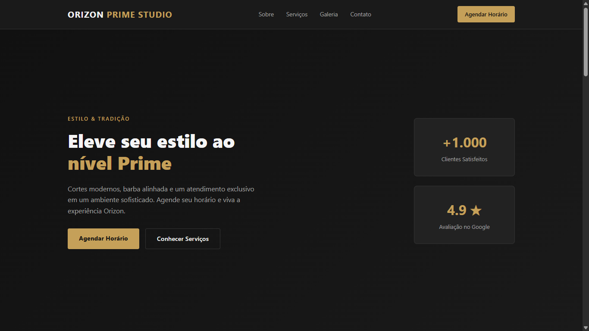

# 💈 Orizon Prime Studio

Landing page responsiva desenvolvida com React para uma barbearia fictícia, apresentando serviços, galeria de cortes, depoimentos e um sistema interativo de agendamento integrado ao WhatsApp.

O projeto foi desenvolvido com foco em **componentização, gerenciamento de estado, formulários, validação, responsividade e experiência do usuário**.

## 🌐 Demonstração

🔗 **[Acessar o projeto online](https://bruno123-n.github.io/orizon-prime-studio-react/)**

---

## 📸 Preview





---

## 🚀 Tecnologias

* **React** — construção da interface e componentização
* **JavaScript (ES6+)** — lógica e interações
* **Vite** — desenvolvimento e build da aplicação
* **CSS3** — estilização, responsividade, Flexbox, Grid e animações
* **Git & GitHub** — versionamento e organização do desenvolvimento

---

## ✨ Funcionalidades

### 🏠 Landing Page

A aplicação é dividida em diferentes seções:

* Header com navegação e acesso ao agendamento
* Hero com apresentação principal
* Seção sobre a barbearia
* Lista de serviços
* Galeria de cortes
* Depoimentos
* Footer com informações de contato

### 📅 Sistema de Agendamento

O projeto possui um formulário de agendamento exibido em um modal.

O usuário pode:

* Informar seu nome;
* Informar telefone/WhatsApp;
* Selecionar um serviço;
* Escolher uma data;
* Selecionar um horário;
* Receber validações durante o preenchimento;
* Impedir agendamentos em datas passadas;
* Impedir agendamentos aos domingos;
* Validar o horário de funcionamento;
* Gerar uma mensagem formatada;
* Enviar o agendamento diretamente pelo WhatsApp.

---

## 🧩 Estrutura do Projeto

A aplicação foi organizada em componentes separados de acordo com suas responsabilidades.

```text
src/
├── components/
│   ├── About/
│   │   ├── About.jsx
│   │   ├── About.css
│   ├── Booking/
│   │   ├── Booking.jsx
│   │   ├── Booking.css
│   ├── Footer/
│   │   ├── Footer.jsx
│   │   ├── Footer.css
│   ├── Gallery/
│   │   ├── Gallery.jsx
│   │   ├── Gallery.css
│   ├── Header/
│   │   ├── Header.jsx
│   │   ├── Header.css
│   ├── Hero/
│   │   ├── Hero.jsx
│   │   ├── Hero.css
│   ├── Services/
│   │   ├── Services.jsx
│   │   ├── Services.css
│   └── Testimonials/
│       ├── Testimonials.jsx
│       ├── Testimonials.css
├── App.css
├── App.jsx
├── index.css
└── main.jsx
```

O `App.jsx` atua como ponto de composição da aplicação e mantém o estado responsável pela abertura e fechamento do formulário de agendamento.

O `BookingForm` recebe esse estado através de props e gerencia internamente os dados preenchidos pelo usuário.

---

## 🧠 Conceitos Praticados

Durante o desenvolvimento foram aplicados conceitos importantes de desenvolvimento front-end:

* Componentização com React;
* Hooks, utilizando `useState`;
* Gerenciamento de estado;
* Comunicação entre componentes através de props;
* Funções de callback;
* Formulários controlados;
* Validação de dados;
* Manipulação de eventos;
* Atualização imutável de objetos de estado;
* Responsividade com CSS;
* Flexbox e CSS Grid;
* Animações e transições;
* Integração com WhatsApp;
* Versionamento com Git e GitHub;
* Utilização de branches para organização do desenvolvimento.

---

## 💻 Como executar localmente

### 1. Clone o repositório

```bash
git clone https://github.com/Bruno123-n/orizon-prime-studio-react.git
```

### 2. Acesse a pasta

```bash
cd orizon-prime-studio-react
```

### 3. Instale as dependências

```bash
npm install
```

### 4. Execute o projeto

```bash
npm run dev
```

O Vite exibirá no terminal o endereço local para acessar a aplicação.

---

## 📦 Build de produção

Para gerar a versão de produção:

```bash
npm run build
```

Para visualizar localmente a versão gerada:

```bash
npm run preview
```

---

## 👨‍💻 Desenvolvido por

**Bruno Lima**

Projeto desenvolvido como parte do meu portfólio de desenvolvimento web, aplicando conhecimentos de React, JavaScript, componentização, gerenciamento de estado, formulários e desenvolvimento de interfaces responsivas.
